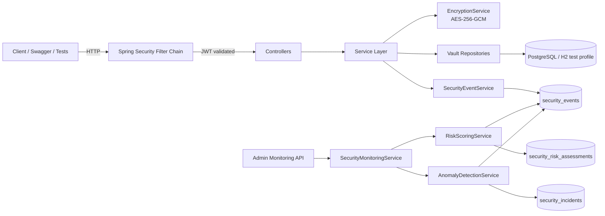

# SecureVault v2 - AI Security Monitoring Edition

SecureVault is a Spring Boot backend that demonstrates practical API security patterns: JWT authentication, per-user authorization, encrypted data storage, audit logging, and security-focused integration testing.

This project was built as a portfolio project to show backend and application security fundamentals in a real, runnable codebase.

## Security Monitoring Edition (v2)

This version extends the original vault with a local, explainable monitoring pipeline:

- Structured `security_events` for auth/access/secret actions
- Explainable risk scoring (`security_risk_assessments`) for USER/IP subjects
- Statistical anomaly detection with rolling baseline + z-score (`security_incidents`)
- Admin-only monitoring API (`/api/security/*`)
- Integration tests that simulate cross-user access attempts and brute-force behavior

## Key Features

- User registration and login with JWT-based stateless authentication
- Secret CRUD API with strict per-user ownership checks
- Dedicated reveal endpoint for controlled plaintext access
- AES-256-GCM encryption for secrets at rest (IV + ciphertext storage)
- Login rate limiting to reduce brute-force attack risk
- Audit logging for auth and secret-related events
- Centralized API error handling with consistent error responses
- Dockerized local database setup (PostgreSQL)

## Security Highlights

- Authentication: JWT tokens validated by a custom security filter
- Authorization: owner-based access enforced at data layer (`findByIdAndOwnerEmail`)
- IDOR/BOLA protection: cross-user reveal attempts are blocked (expected `404` in current implementation)
- Secret management: no plaintext secret values are persisted in the database
- Configuration hygiene: sensitive values loaded from environment variables, not hardcoded
- Repository hygiene: `.env` is ignored, `.env.example` provided as template
- CI protection: GitHub Actions secret scanning via Gitleaks

## Tech Stack

- Java 21
- Spring Boot 4
- Spring Security
- Spring Data JPA / Hibernate
- PostgreSQL
- H2 (test profile)
- JUnit 5 integration tests
- Maven
- Docker / Docker Compose

## API Overview

Authentication:

- `POST /auth/register`
- `POST /auth/login`

Secrets:

- `GET /api/secrets`
- `POST /api/secrets`
- `GET /api/secrets/{id}`
- `GET /api/secrets/{id}/reveal`
- `PUT /api/secrets/{id}`
- `DELETE /api/secrets/{id}`

Note: `GET /api/secrets` returns metadata only. Plaintext is only returned by `GET /api/secrets/{id}/reveal` for the owning user.

Security Monitoring (ADMIN only):

- `GET /api/security/overview`
- `GET /api/security/incidents?page=&size=`
- `GET /api/security/anomalies?page=&size=`
- `GET /api/security/risk/top?window=24h&limit=10`

## API Documentation

Interactive API documentation is available via Swagger UI:

- `http://localhost:8080/swagger-ui.html`

Raw OpenAPI specification:

- `http://localhost:8080/v3/api-docs`

## Architecture



## Risk Scoring Rules (Explainable)

| Rule | Points | Rationale |
|------|--------|-----------|
| `AUTH_LOGIN_FAIL` | +25 each | Repeated failed logins indicate credential attacks |
| `AUTH_RATE_LIMIT_TRIGGERED` | +60 each | Strong signal of brute-force behavior |
| `AUTH_FORBIDDEN` or `SUSPICIOUS_ENUMERATION` | +80 each | High-risk unauthorized access pattern |
| High reveal activity (`SECRET_REVEALED` > 5/window) | +15 | Abnormally high secret access volume |

Scores are computed per subject (`USER` and `IP`) over a configurable window (default: `24h`) and include reason codes.

## Example Responses

`GET /api/security/overview`

```json
{
  "loginFailsLast24h": 8,
  "rateLimitsLast24h": 1,
  "forbiddenLast24h": 1,
  "revealsLast24h": 3,
  "topRiskySubjects": [
    {
      "subjectType": "IP",
      "subjectValue": "203.0.113.77",
      "score": 260,
      "topReasons": ["LOGIN_FAIL_x8", "RATE_LIMIT_x1"]
    }
  ],
  "openIncidents": [
    {
      "incidentId": 12,
      "category": "RULE",
      "severity": "HIGH",
      "subjectType": "USER",
      "subjectValue": "sec-b+123@test.com",
      "reasons": ["CROSS_USER_SECRET_ACCESS_ATTEMPT"]
    }
  ]
}
```

`GET /api/security/incidents?page=0&size=2`

```json
{
  "content": [
    {
      "incidentId": 12,
      "category": "ANOMALY",
      "severity": "MED",
      "subjectType": "IP",
      "subjectValue": "203.0.113.77",
      "reasons": ["ANOMALY_FAILED_LOGINS_PER_HOUR", "Z_SCORE_10.00"]
    }
  ]
}
```

## Running Locally

1. Create a local `.env` file from `.env.example`.
2. Start PostgreSQL:

```bash
docker-compose up -d
```

3. Start the app:

```bash
./mvnw spring-boot:run
```

On Windows PowerShell:

```powershell
.\mvnw.cmd spring-boot:run
```

## Environment Variables

Example values (see `.env.example`):

```env
JWT_SECRET=your-strong-secret
AES_KEY=base64-32-byte-key
DB_PASSWORD=change-me
```

## Testing

Run all tests:

```bash
./mvnw clean test
```

Windows PowerShell:

```powershell
.\mvnw.cmd clean test
```

Security integration test included:

- `SecretAuthorizationITTest`
  - User A can reveal own secret (`200`)
  - User B cannot reveal User A secret (`403` or `404`, currently `404`)
- `SecurityMonitoringITTest`
  - Cross-user reveal attempt increases risk and creates incident
  - Brute-force simulation triggers rate-limit and monitoring signals
  - Normal behavior does not create high-severity anomaly for that user

## CI

GitHub Actions runs CI on every push to `main` and on every pull request.

- Build and test pipeline: `./mvnw -B clean test` (Java 21)
- Security pipeline: Gitleaks secret scanning

## Why This Project Is Relevant

This repository demonstrates that I can:

- design secure backend APIs beyond basic CRUD
- implement and verify authorization boundaries
- apply encryption and environment-based secret management
- write integration tests for real attack scenarios (IDOR/BOLA)
- package and run services in a reproducible local environment

## Author

Yassin El Founti

B.Sc. IT Student

Backend & Application Security Enthusiast
